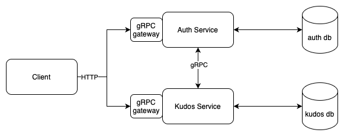
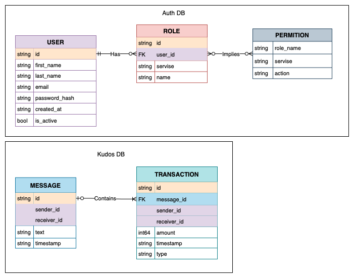

# Kudos Vault
Kudos Vault is a system for gratitude expression. Users may gift each other internal currency in order to share their gratitude.

## Project reasons and value

Building company culture is a long and important process, which directly influence employees motivation and wellbeing. 
Centralised system of gratitude exchange will provide coworkers the tool for sharing words of appreciation and collect 
their own kudos in one place. Moreover, it will allow company to regulate its politics on workers metherial motivation, 
making such opportunities transparent for all workers.

## Project goals

System MVP will address the next goals:
- Support up to 1000 concurrent users
- Provide kudos gifting functionality for users
- Provide administration panel
- Guarantee consistency of transactions

Possible upgrades:
- Introduce repetitive awards: top department employee of a month, employment anniversary, welcome bonus, ect

## Use Cases and User Stories

System will include the following types of users:
- admins
- regular users

Their interaction with the system will be as follows:

### EPIC 1: Basic functionality

#### Feature: Login & Registration
>As a regular user
I want to register or login to the system
So that I can see my kudos and interact with other users

#### Feature: Points exchange
>As a regular user
I want to see my available points
So that I can plan how much I am willing to gift

>As a regular user
I want to see my collected points
So that I know my account balance

>As a regular user
I want to send another user a message with some points, available to me
So that I can express my appreciation and make a material gift

>As an admin
I want to broadcast all users specified amount of points
So that all users can start gifting

>As a regular user
I want to see received gifts in chronological order
So that I can immediately see fresh kind words from my colleagues

#### Feature: Points withdrawal

>As a regular user
I want to make request for balance withdrawal
So that I can receive material equivalent

>As an admin
I want to see all withdrawal requests
So that I can access each of them

>As an admin
I want to approve user point withdrawal
So that I provide material equivalent in exchange

### EPIC 2: Extension for better economy
#### Feature: Top users

>As a regular user
I want to see top 10 users by their kudos in company and in my department
So that I am motivated to be there

#### Feature: Fired workers

>As an admin
I want to disable/activate user
So that I control who must no longer have access to the system

#### Feature: Inactive points redistribution

>As an admin
I want to stop system by removing all un-gifted points from users to shared bank
So that un-gifted points are not collected by inactive users

>As an admin
I want to distribute shared bank between active users
So that they are gifted by their activity

#### Feature: Search

>As a regular user
I want to search another user by name
So that I can quickly find target for kudos gifting

# Architecture
The system is chosen to be implemented with microservices. With such structure it will be
easier to integrate it with existing services, such as auth service.

### High-level block diagram
The following diagram highlights the main system components and how they will communicate.
gRPC will be the main way of communication, as MVP has no async events. gRPC-Gateways will transform HTTP requests from
frontend, allowing to reuse single protobuf api specification.

### Entity Relationship diagram
Next diagram in this description depicts the structure of Auth and Kudos DBs, each including several
entities as tables with marked relations by color

